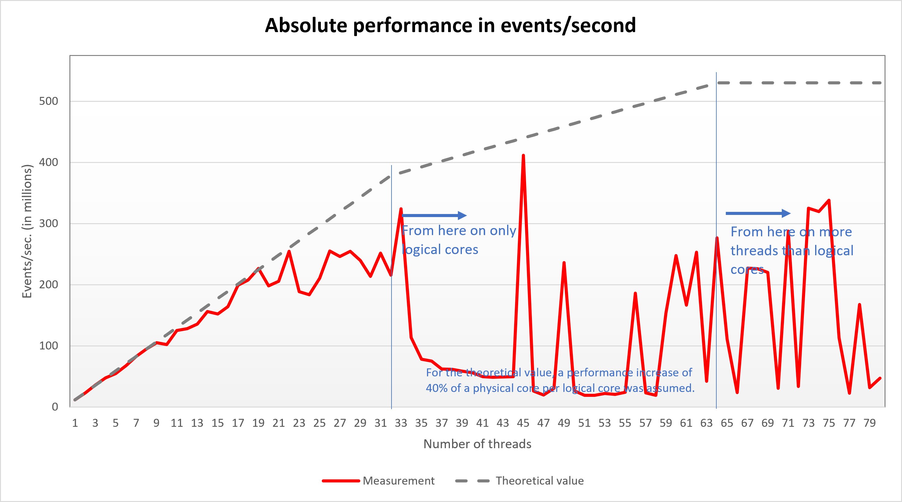
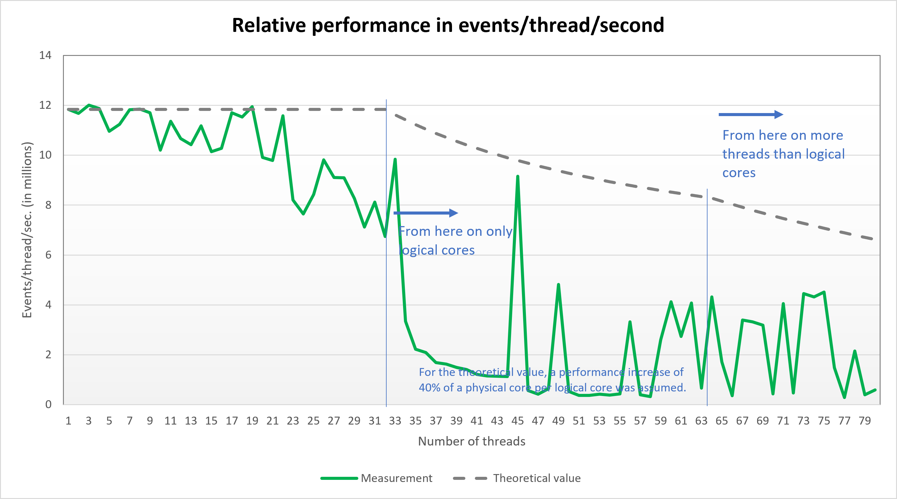
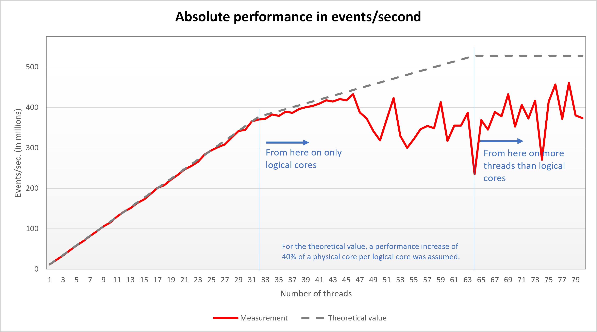
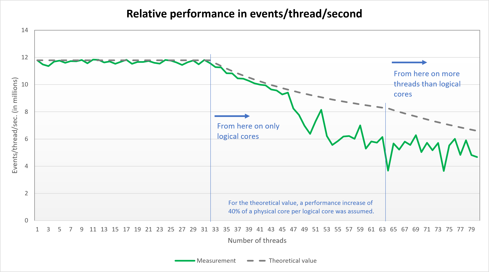

# Simple discrete event-oriented simulator for G/G/c models (Java edition)

This is a very simple discrete event-oriented simulator (DES) which can simulate G/G/c models. The results are shown on the console.
The statistic recording is very basic.
The main purpose of the tool is not to gain new insights into queueing theory, but rather to get an upper estimate of the maximum speed a simulation tool can achieve on a given computer.

## Model

The simulator can generate pseudo-random numbers according to the exponential distribution and to the log-normal distribution.
If a coefficient of variation of 1 is chosen for some parameter, the exponential distribution will be used; otherwise the log-normal distribution will be used.

Default values if not overwritten by command-line arguments:

* Mean inter-arrival time **E[I]=100**
* Coefficient of variation of the inter-arrival times **CV[I]=1**
* Mean service time **E[S]=80**
* Coefficient of variation of the service times **CV[S]=1**
* Number of operators **c=1**
* Number of arrivals to be simulated **arrivals=100,000,000**
* Number of threads to be used **threads=&lt;number of available logical CPU cores&gt;**

The number of arrivals is distributed equally between all used threads. The statistic results are combined at the end of the simulation process.

## Command-line arguments

The model parameters above can be altered by command-line arguments. All model parameters not being changed via command-line are kept on the default values.

* `EI=` mean inter-arrival times (positive floating point number)
* `cvI=` coefficient of variation of the inter-arrival times (non-negative floating point number)
* `ES=` mean service times (positive floating point number)
* `cvS=` coefficient of variation of the service times (non-negative floating point number)
* `c=` number of operators (positive integer)
* `arrivals=` number of arrivals (positive integer; can be more than 4 bil.)
* `threads=` number of threads to be used (positive integer)
* `increase_arrivals` (no additional value) multiplies the actual number of arrivals by the number of threads
* `show_times` (no additional value) shows the runtime of the individual threads
* `load_balancer` (no additional value) activates load balancing between the threads

The `increase_arrivals` parameter is useful for benchmarking: When using this parameter the average runtime will be approximately the runtime of the specified number of arrivals in the single thread case. (So the runtimes will not become shorter when increasing the number of threads.)

The number of threads can be larger than the number of available logical CPU cores.

## Benchmarking script

The `TinyFastSimulator-Benchmark.sh` (no load balancer mode) and the `TinyFastSimulator-Balanced-Benchmark.sh` (load balancer mode) scripts can be used to test the performance in relation to the number of threads. The scripts are to be called with three parameters: the maximum number of threads to be used, the number of arrivals per thread and the output file. The scripts will run the simulator with one threads and the number of arrival specified; then with two threads and the double total number of arrivals etc. until the specified maximum number of threads is reached. For each simulation run one line is added to the specified output file. Each line will have three columns: the number of threads used, the runtime (in seconds) and the used RAM (in KB). To get statistical stable result a number of arrivals of 100,000,000 or higher should be used.

Usage example: `./TinyFastSimulator-Benchmark.sh 32 100000000 results.txt`

## Benchmark results

The following benchmarks were performed on a system with two CPU of the type AMD Epyc 7281 (Zen+ architecture, 16 physical / 32 logical cores each).

### No load balancer





### Load balancer





Even so the benchmark probably runs completely from the cache and hardly accesses the RAM, the SMT winnings are nevertheless very high.

The number of arrivals was 100,000,000 in the single thread case, 200,000,000 when using two threads etc. In this way the simulation runtime are (approximately) constant over all numbers of threads.

## Building

A `jar` file can be generated using Maven. Just go to the `tinyfastsimulator` folder and run
```
mvn package
```
The `jar` file will be generated in the `tinyfastsimulator/target` folder.

## Contact

[Alexander Herzog](https://github.com/A-Herzog)